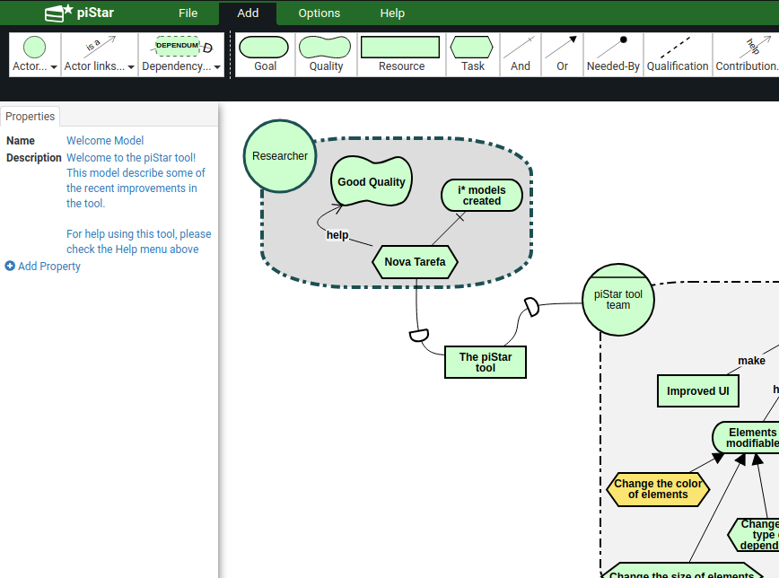
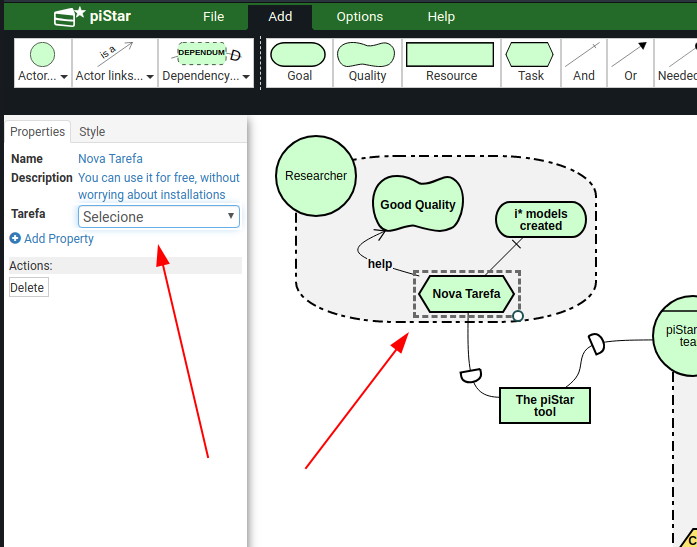
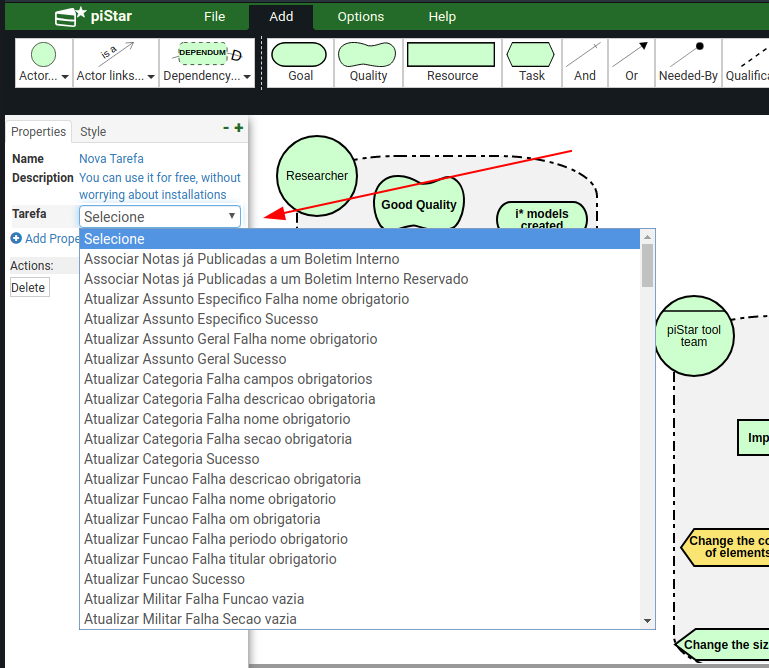
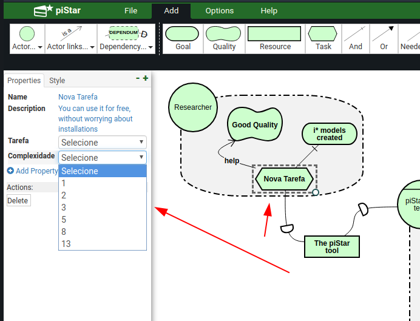

# Passo a passo de instalação e um pouco do funcionamento

__Observação Importante:__ O procedimento abaixo leva em consideração que a ferramenta vai rodar num servidor GNU/linux, ou seja, os comandos abaixo listados são para distribuições Linux, usando a distribuição Ubuntu como exemplo.

##Instalação do Apache HTTP Server:

Para instalar o servidor HTTP, execute o comando abaixo. Lembre-se que a senha de administrador do sistema é necessária para executar o comando:

```shellscript
apt install apache2
```

Agora, assumindo que você já tenha o servidor HTTP (Apache HTTP Server) com serviço em funcionamento, faça uma clonagem do repositório do projeto com o comando:
 
```
git clone https://github.com/lealfb/bdd2Goal.git
```
Uma vez baixado o repositório, faça uma cópia do diretório "tool" e todos seu conteúdo para a diretório de execução do Apache. Por padrão no Ubuntu, o diretório fica localizado no endereço abaixo: 

> /var/www/html 

Caso tenha outra configuração no seu servidor HTTP, altere o destino conforme necessário para o seu sistema.
 
 ```
 cp -R bdd2Goal/tool /var/www/html/pistar
 ```
 
 Lembre-se que você deve ter permissão para copiar o diretório (usuário root). E após copiar o diretório, é importante também definir as permissões de leitura e escrita para o mesmo.
 
 ```
 chown -R www-data:www-data /var/www/html/pistar
 ```
 
 ## Notas Importantes
 
 Com base no projeto original, foi desenvolvido um plugin, localizado no endereço do projeto abaixo:
 
 > app/ui/pistar_plugin.js
  
 Neste arquivo estão contidas novas funções as quais sobreescrevem o funcionamento original do piStar. o qual é responsável por carregar a lista de tarefas.
 
 Além do arquivo de plugin, também existe um novo diretório chamado "json", o qual contém diversos arquivos JSON que é a base para funcionamento do novo tipo de propriedade contendo as taferas. Um novo script de plugin sobre-escreve as propriedades do funcionamento original do piStar e carrega valores pré-definidos desse diretório contendo os arquivos JSON.
 
 Com o serviço em execução, acesse o endereço do servidor, como no exemplo abaixo:
 
 http://localhost/pistar
 
 O sistema deve apresentar a página de entrada.
 
 
 
 
 Ao selecionar uma tarefa (objeto task), e adicionar um novo atributo, o sistema deve mostrar ao invés de um campo livre, um campo de seleção única contendo a lista carregada a partir do diretório __json__ na raiz do projeto, conforme a imagem abaixo.
 
 
 
 
Ao adicionar uma nova propriedade num objeto do tipo "Tarefa (Task)", deverá aparecer um menu contendo as tarefas pre-definidas do diretório contendo os diversos arquivos JSON.



Adicionando mais um novo atributo, o sistema irá adicionar um novo combobox contendo uma lista de nível de complexidade.



## Como funciona o plugin

Primeiramente, o plugin inicia uma requisição Ajax para listar o diretório JSON do pistar, com a função abaixo:

```javascript
$.ajax({
    url: "json/",
    success: function (data) {
	$(data).find("a").each(function (a, b) {
	    if (/.+\.json/.test(b.href)) {
		var href = b.href;
		var base = href.replace(/\/[a-f|A-F|0-9]+.json$/, '');
		var href = href.replace(base, '');
		fList.push('json' + href);
	    }
	});
    }
});

function loadNames() {
    fList.forEach(function (jsonFile) {
	$.getJSON(jsonFile, function (data) {
	    titulos.push(data.name);
	});
    });
}

```
Uma das necessidades de utilizar o servidor HTTP em execução é para poder listar o diretório com os arquivos de forma remota, sem violar as restrições do protocolo SOAP. Após ser feita a requisição, cada arquivo JSON do diretório é aberto e lido para armazenar o atributo __"name"__ do mesmo, o qual é a lista de tarefas predifinida no projeto.


## Sobreescrevendo o código original do piStar

No trecho javascript abaixo, começamos a sobreescrever o código original do piStar com o funcionamento necessário. Foi utilizada essa abordagem para não alterar a estrutura original do projeto e flexibilizar a possibilidade de atualização de código sem alterar o código fonte original do projeto base. Como podemos ver, é um atributo do objeto do piStar recebendo uma nova função como atributo, realizando assim a sobre-escrita.

```javascript
ui.components.PropertiesTableView.prototype.renderCustomProperty = function (propertyName) {

    console.log(this.model.attributes.type);
    
    if (this.model.attributes.type == 'Task') {

	var customProperties = this.model.attributes.customProperties;

	var keys = Object.keys(customProperties);
	
	var customTemplate = null;

	switch (keys.indexOf(propertyName)) {
	    case 1:
		customTemplate = renderCustomPropertyTemplate(propertyName, this.model.prop('customProperties/' + propertyName));
		break;
	    case 2:
		customTemplate = renderComplexityTemplate(propertyName, this.model.prop('customProperties/' + propertyName));
		break;
	    default:
		customTemplate = this.template({
		    propertyName: propertyName,
		    propertyValue: this.model.prop('customProperties/' + propertyName),
                    dataType: 'textarea'
		});
	}


    } else {
        
        this.$table.find('tbody').append(this.template({
            propertyName: propertyName,
            propertyValue: this.model.prop('customProperties/' + propertyName),
            dataType: 'textarea'
        }));
    }

    this.$table.find('tbody').append(customTemplate);
};
```


